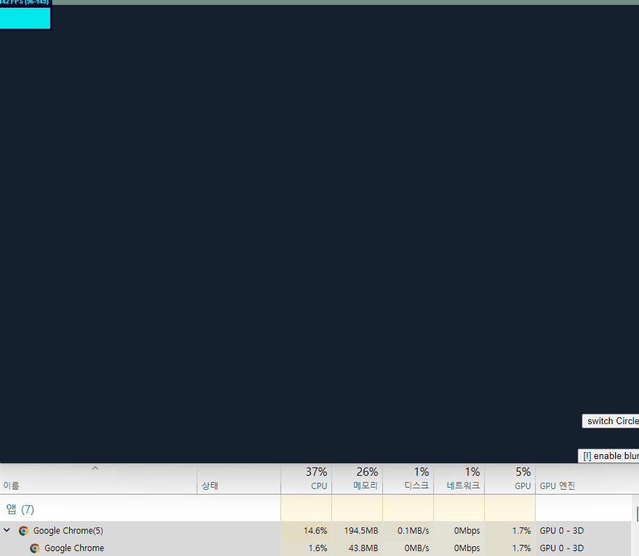

## 만들면서 어려웠던 점?
mousePosition을 아무 생각 없이 useState로 처음에 관리했는데 그러면 매 프레임마다 rerender가 발생해서 성능이 매우 떨어지게 됨. useRef로 해서 해결함.

## 문제점

blur 효과는 넣으면 미적으로는 좋지만 성능하락이 커짐. 특히 모바일에서는 30프레임 이하로 떨어지기도 함. html dom element라면 각각 처리를 css로 할 수도 있겠지만 canvas 내의 요소라서 그런 접근은 어려움. 어디서 읽기로는 alpha 옵션을 끄면 성능 향상이 있다고 함.

blur만 끄면 모바일에서 120프레임도 충분히 나옴.

ryzen 3600 + rtx 2080 에서의 대략적인 성능 측정

## 성능 향상 가능한 지점?
- alpha 끄기
`context = canvas.getContext('2d', { alpha: false });`

- 배치 캔버스 사용
코드에서 circle나 line을 그릴 때, 매 요소마다 path 생성하고 채우고를 반복함. 앱 의도는 마우스 자취를 그릴 때 그 선이나 원의 색이 그라데이션을 이뤘으면 해서 매 요소마다 순서대로 그리도록 작성했음.

만약 채우는 색을 하나도 통일하고 한번에 `fill()`이나 `stroke()`를 호출하면 성능이 개선된 것으로 예상됨.

