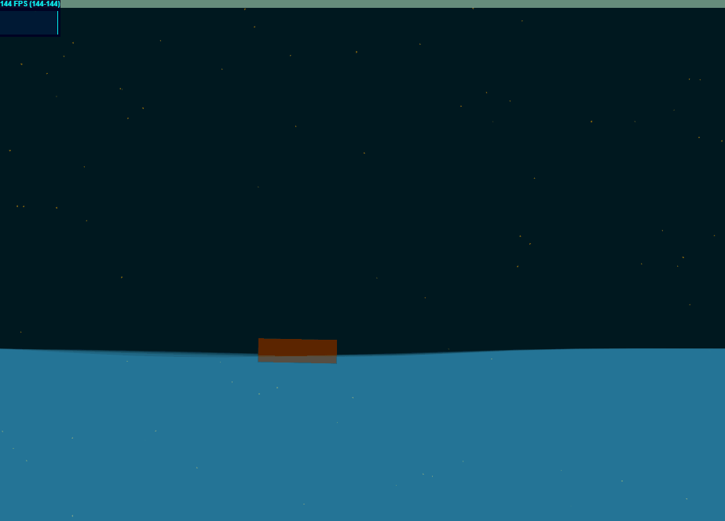

## 초기화
- 별 생성
- WaveGroup 생성
- Rectangle 만들 포지션 정하기

## 매 프레임마다 반복
- 캔버스 초기화
- 캔버스 회전하고 별 그리기. 그리고 캔버스 되돌리기
- WaveGroup 내의 Wave의 Point마다 위치 재설정 및 그리기
- Point 설정 시에 각 Point마다의 기울기 계산 및 Rectangle에 적용해서 그리기

## 창 크기 변경시
- 별 재생성
- WaveGroup 재생성
- Rectangle 만들 포지션 정하기

## 디버깅?
vscode에서 실행하고 breakpoint걸면서 확인 가능

## 문제점 및 해결?
resize 시에 props.windowSize로 직접 변경했더니 배경이나 물결이 제대로 리사이즈 안됨. 대신에 context.canvas.width, context.canvas.height로 변경하니까 제대로 작동함. 앞으로는 screen space 재설정 할 때는 context.canvas 값으로 하는 것으로...

